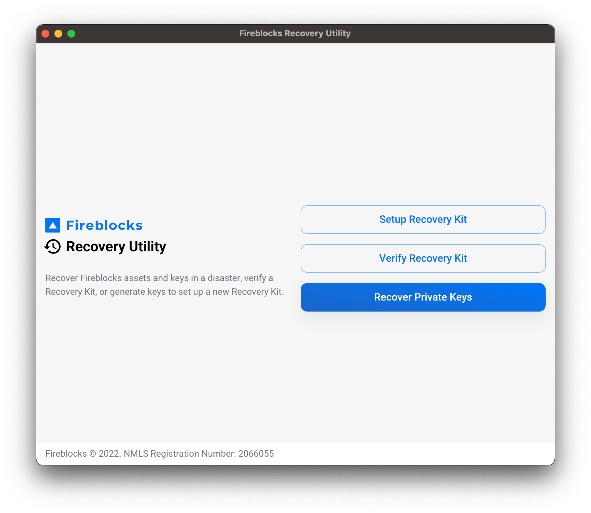
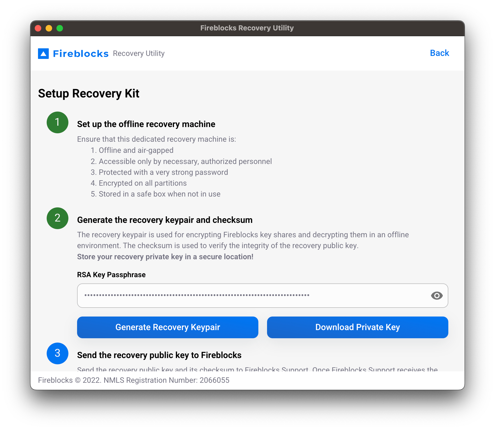
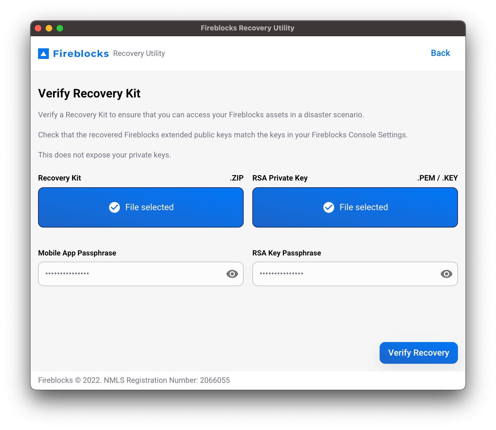
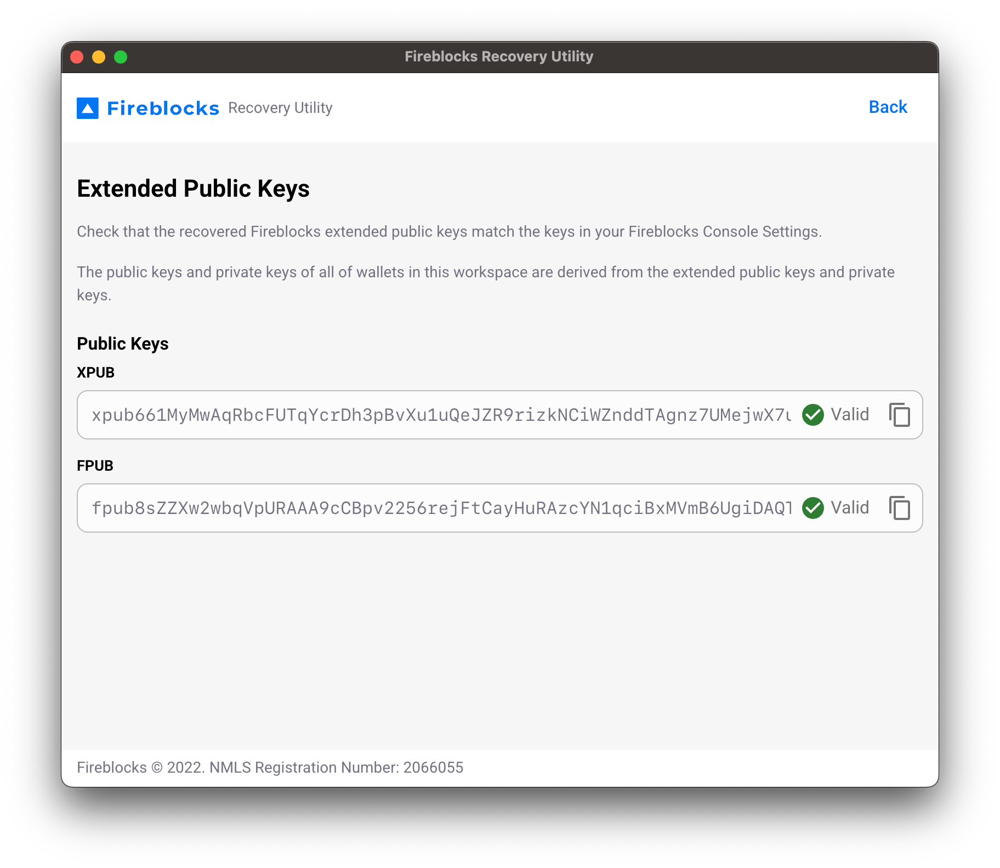
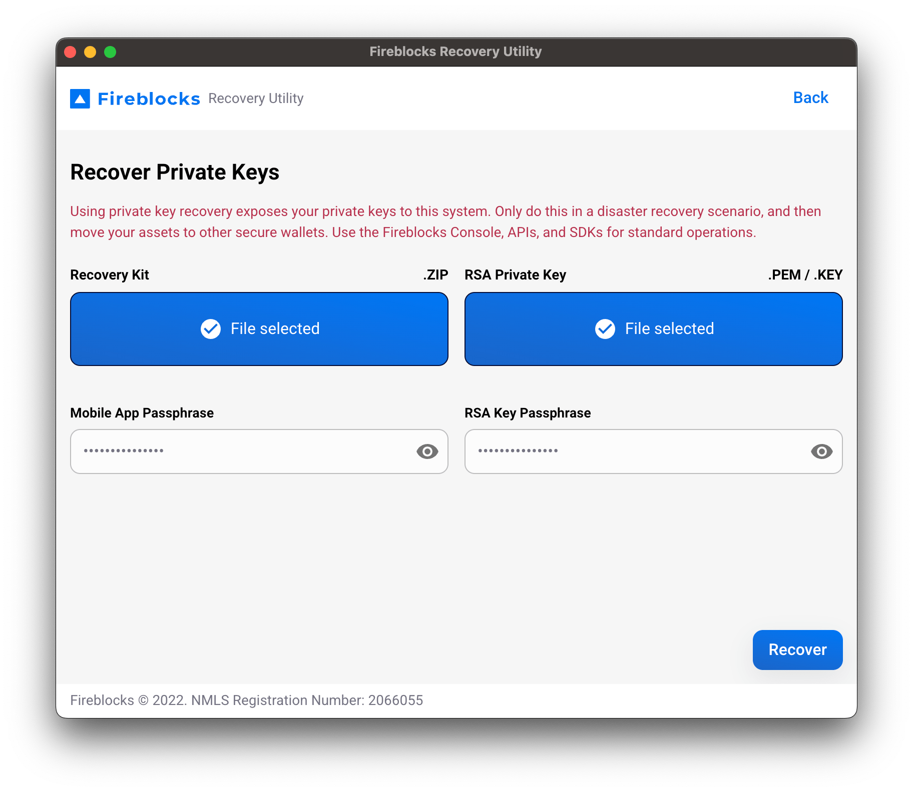
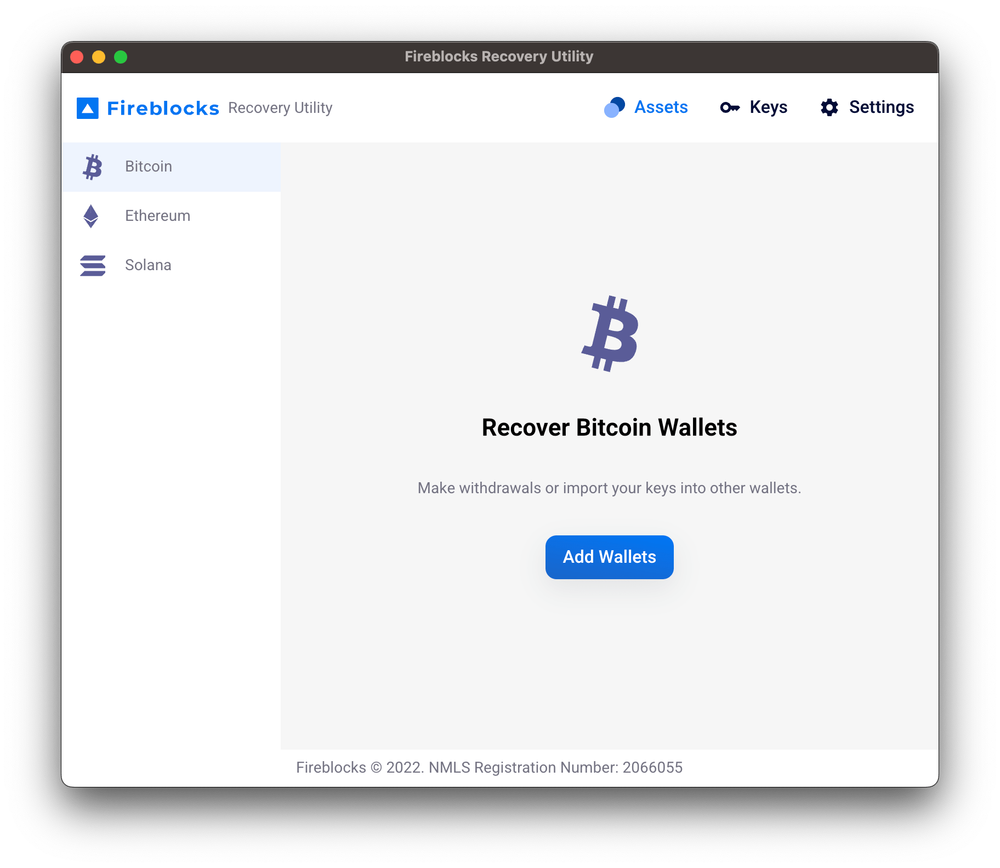

<h1 align="center">
  
   
  Fireblocks Recovery Utility
</h1>

  Recover Fireblocks assets and keys in a disaster, verify a Recovery Kit, or generate keys to set up a new Recovery Kit.

  

---

## 🆕 Coming from [fireblocks-key-recovery-tool](https://github.com/fireblocks/fireblocks-key-recovery-tool)?

[Recovery Utility](packages/app) verifies and performs hard key recovery with an easy interface, and when used with [Recovery Relay](packages/relay), creates transactions to withdraw from recovered wallets. If you create a new workspace, it makes it easy to set up a new Recovery Kit with no terminal commands.

## 👍 Usage

1. Setup a dedicated offline recovery machine. It must be:
   - Offline and air-gapped
   - Accessible only by necessary, authorized personnel
   - Protected with a very strong password
   - Encrypted on all partitions
   - Stored in a safe box when not in use
2. Install the latest [release](/release) of [Recovery Utility](packages/app) on the offline recovery machine.
3. **(Optional)** Install the latest [release](/release) of [Recovery Relay](packages/relay) on a web server. Recovery Relay is a companion web app that creates transactions from recovered wallets. Fireblocks hosts an instance at [fbrelay.app](https://fbrelay.app), but you can host your own instance and set its URL in Recovery Utility's Settings tab.
4. Open Recovery Utility to use one of the following tools...

## 🧰 Tools

### 🆕 Setup Recovery Kit

Generate an RSA keypair and checksum for a new Recovery Kit. If you already have your backup .zip, RSA keypair with passphrase, and owner's mobile app passphrase, then you can skip this and proceed to Verify Recovery Kit.

  

### ✅ Verify Recovery Kit

With your Recovery Kit .zip, RSA private key with passphrase, and owner's mobile app passphrase, you can verify your ability to perform a hard key recovery. Recovery Utility uses these materials to generate your workspace's `xpub` and `fpub` extended public keys. Check that the these extended public keys match the keys in your Fireblocks Console Settings.

  
  

### 🔑 Recover Private Keys

With your Recovery Kit .zip, RSA private key with passphrase, and owner's mobile app passphrase, you can recover the extended private keys (`xprv` and `fprv`) of your Fireblocks workspace, derive wallets to recover your assets' private keys, and create transactions by scanning a QR code to the Recovery Relay web app.

#### 🚨 WARNING

Using private key recovery exposes your private keys to the host machine. Only do this in a disaster recovery scenario, and then move your assets to other secure wallets. Use the Fireblocks Console, APIs, and SDKs for standard operations.

  
  

## 🔨 Development

See [CONTRIBUTING](docs/CONTRIBUTING.md)

## ⚖️ Legal

[MIT License](LICENSE)

Fireblocks © 2022. NMLS Registration Number: 2066055
