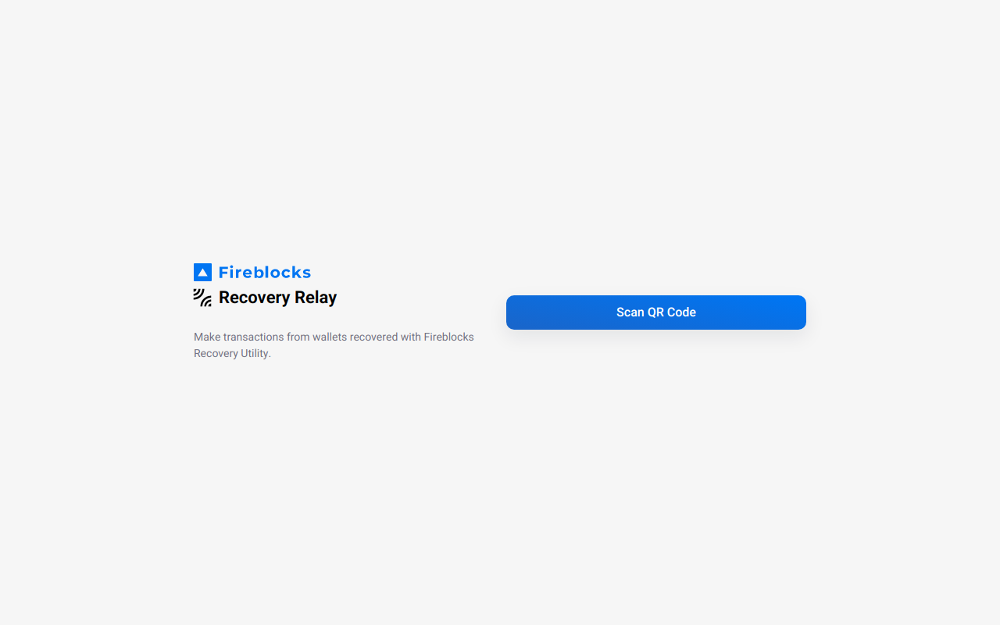

<h1 align="center">
  
  <br />
  Fireblocks Recovery Relay
</h1>

<p align="center">
  Connect recovered wallets to query balances and send transactions without revealing private keys.
  <br />
  <br />
  <a href="https://vercel.com/new/clone?repository-url=https%3A%2F%2Fgithub.com%2Ffireblocks%2Frecovery%2Ftree%2Fmain%2Fapps%2Frecovery-relay&build-command=cd%20..%2F..%20%26%26%20npx%20turbo%20run%20build%20--filter%3D%40fireblocks%2Frecovery-relay&project-name=recovery-relay&demo-title=Fireblocks%20Recovery%20Relay&demo-description=Connect%20recovered%20wallets%20to%20query%20balances%20and%20send%20transactions.&root-directory=apps%2Frecovery-relay" target="_blank">
    
  </a>
  <a href="https://www.netlify.com/img/deploy/button.svg)](https://app.netlify.com/start/deploy?repository=https://github.com/fireblocks/recovery/tree/main/apps/recovery-relay" target="_blank">
    
  </a>
  <br />
  <br />
  <a href="https://github.com/fireblocks/recovery" target="_blank">
    
  </a>
</p>

---

## 📚 User Guide

After using [Recovery Utility](../recovery-utility/) on on an airgapped device to recover private keys and wallets in a disaster:

- Get the balance of a vault account or asset, or start a withdrawal.
- Scan the QR code shown in Recovery Utility with a phone or an internet-connected computer to open a Recovery Relay URL.
- To send data back to Recovery Utility, use a webcam on the airgapped to scan a QR code from Recovery Relay.

You can set the Recovery Relay URL in Recovery Utility settings. You can use this repository to build and host the site static files yourself.

## Development Scripts

Use the [Recovery Utility monorepo](../../) for development and deployment as Recovery Utility depends on several other packages.

Recovery Relay, like Recovery Utility, is built with [React](https://reactjs.org/) on the [Next.js](https://nextjs.org/) framework, using [Material UI](https://mui.com/material-ui/getting-started/overview/) components. It can be hosted on any static file server.

### Build for production

```bash
yarn build
```

When configuring in CI such as Vercel, set the root directory to `apps/recovery-relay` and the build script to:

```
cd ../.. && npx turbo run build --filter=@fireblocks/recovery-relay
```

### Start development server

```bash
yarn dev
```

Open [http://localhost:3000](http://localhost:3000) with your browser to see the result.

You can start editing the page by modifying `pages/index.tsx`. The page auto-updates as you edit the file.

## Learn More

To learn more about Next.js, take a look at the following resources:

- [Next.js Documentation](https://nextjs.org/docs) - learn about Next.js features and API.
- [Learn Next.js](https://nextjs.org/learn) - an interactive Next.js tutorial.
