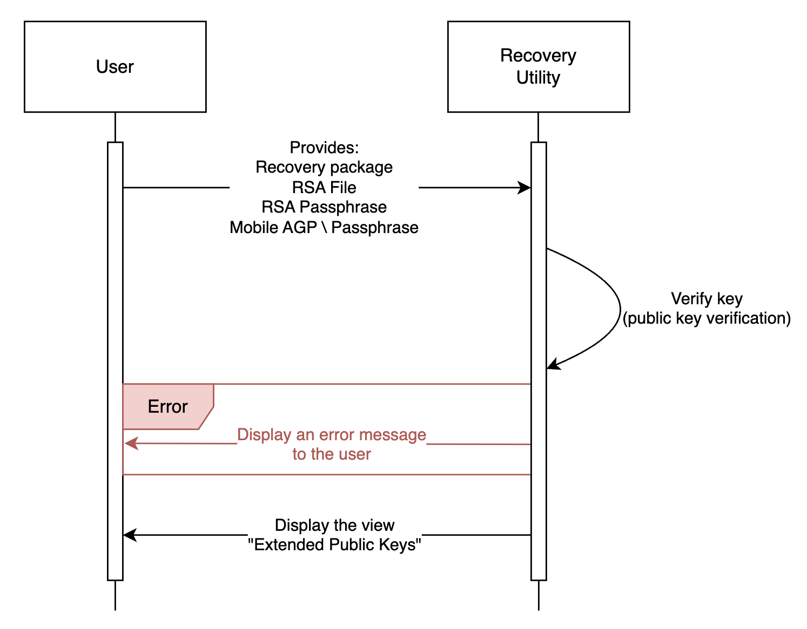
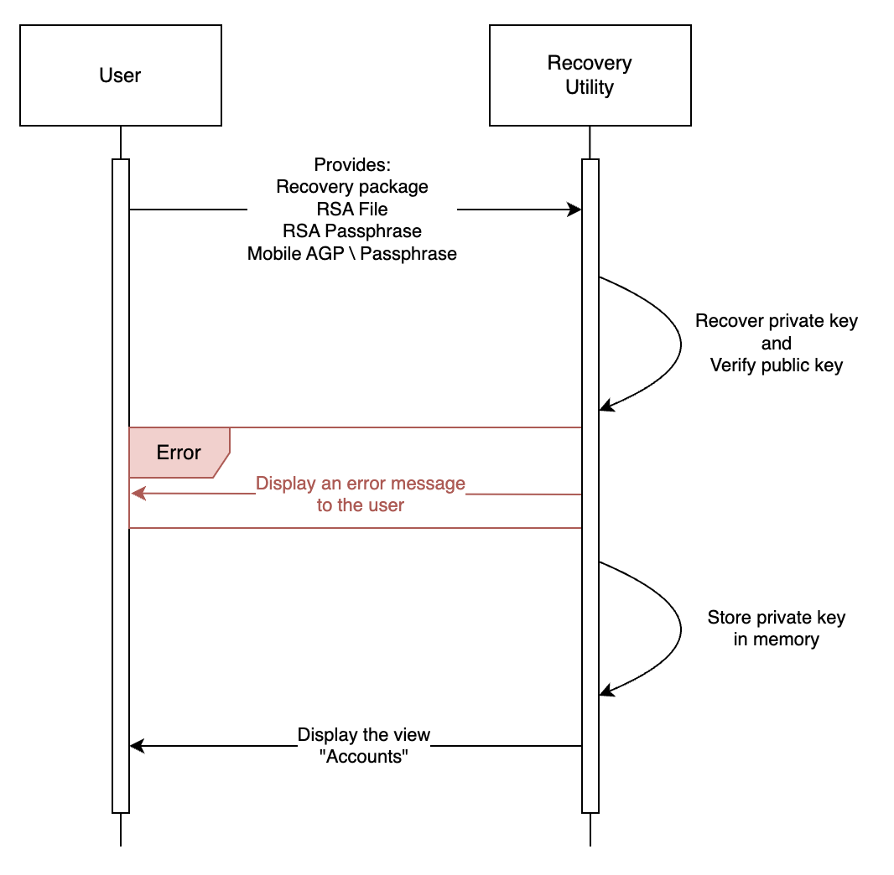
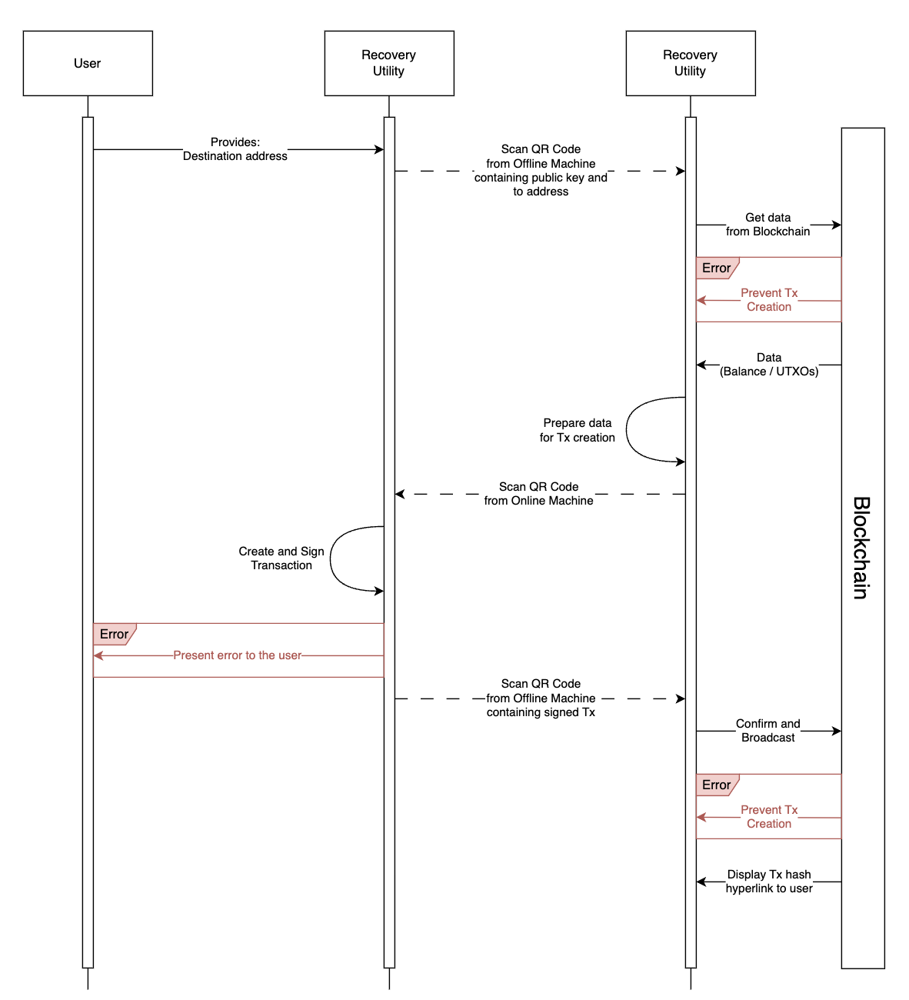

# <u>**Recovery Tool Developer Guide**</u>

This guide's purpose is to provide a detailed explanation of the technical aspects of the Recovery tool. This includes but is not limited to:

- High level architecture
- Flow explanation
- Potential error locations
- Code structure
- Extendability

The guide can be used to add capabilities or new blockchains in case of disaster recovery.

Note: xprivate and xpublic is the extended private and extended public key, these are the root keys of the workspace and 

## <u>Table of Contents</u>

- [Operations Flow](#operations-flow)
- [Package Structure](#package-structure)
  - [Recovery Utility](#recovery-utility)
  - [Recovery Relay](#recovery-relay)
  - [Shared - Extended Key Recovery](#shared---extended-key-recovery)
  - [Shared - Asset Config](#shared---asset-config)
  - [Shared - Wallet Derivation](#shared---wallet-derivation)
  - [Shared](#shared)
- [Adding Assets](#adding-assets)

## <u> Operations Flow</u>

This section reviews the architecture of the recovery tool as well as how operations take place.

As an introductory portion, we first describe the main components of the recovery tool.

After understanding the main components we then review the architecture and finally how operations are performed. Where applicable we include dependency information.

### Main Components

The main components of the Recovery Utility are the `Recovery Utility` and `Recovery Relay`. Both of them make use of some of the packages as well as 3rd party dependencies.

`Recovery Utility` - this component **must** be used **only** on the offline machine. It houses the private key material and is responsible for transaction creating and signing. It uses data provided to it from the external `Recovery Relay` to construct the transaction.

`Recovery Relay` - this component runs on the online machine and houses blockchain interaction logic. It is responsible for obtaining data from the relevant blockchain and to perform the broadcast of the transaction.

These two components are the main part of the recovery tool and all flows involve these two components.

### Operations Flow

The operations that are covered are the following:

- Verification of the recovery package
- Recovery of the private key material
- Withdrawing funds

#### Verification of the Recovery Package

The package verification process recovers the xprivate key material to compute the xpublic key, and compares it to the provided xpublic key in the metadata of the package. 

Due to this, this operation **must** be done on a offline machine. 
Note: AGP means Auto-Generate Passphrase

#### Recovery of the xPrivate Key Material

The private key material recovery process recovers the private key material along with computing the xpublic key. The xpublic key is verified in the same process as in the verification flow (against the metadata).

If there is an error it is displayed to the user, otherwise the xprivate key value is stored in the followed by showing the user the "Accounts" view.

#### Withdrawing Funds

The main item missing from the above diagram is the actual key derivation process, however key derivation is extensively covered throughout resources online, therefore we do not discuss it.

## <u>Package Structure</u>

This section covers the structure of the packages within the Recovery tool and their purposes.

### Recovery Utility

The recovery utility package is the corner-stone of the recovery utility, and contains the main UI and logic for the entire tool.

#### `main`

This folder contains general utilities for Electron.

- [`helpers`](../../apps/recovery-utility/main/helper/README.md) - @GRANT
- [`ipc`](../../apps/recovery-utility/main/ipc/README.md) - @GRANT
- [`store`](../../apps/recovery-utility/main/store/README.md) - @GRANT

#### `renderer`

This folder contains the main UI and logic for transaction creation and signing.

- [`components`](../../apps//recovery-utility/renderer/components/README.md) - @GRANT
- [`context`](../../apps/recovery-utility/renderer/context/README.md) - @GRANT
- [`lib`](../../apps/recovery-utility/renderer/lib/README.md)
- [`pages`](../../apps/recovery-utility/renderer/pages/README.md) - @GRANT
- [`public`](../../apps/recovery-utility/renderer/public/README.md) - @GRANT

 

---

### Recovery Relay

The recovery relay is responsible for all communication with the blockchain be it gathering information from the blockchain (such as balances, UTXOs or other metadata needed for transaction creation).

The following are the main folders for the relay code.

- [`components`](../../apps//recovery-relay/components/README.md) - @GRANT
- [`context`](../../apps/recovery-relay/context/README.md) - @GRANT
- [`lib`](../../apps/recovery-relay/lib/README.md)
- [`pages`](../../apps/recovery-relay/pages/README.md) - @GRANT
- [`public`](../../apps/recovery-relay/public/README.md) - @GRANT

---

### Shared - Extended Key Recovery

The Extended Key Recovery package provides the cryptography code that is used to take the individual shards of the private key and combining them into the real private key material.

This package does not contain any folders, only two relevant files.

Extendability is not meant to be part of this package, since addition of curves to the Fireblocks key capabilities (such as Stark Curve or JubJub) will be added to the recovery tool as soon as they have been added into the production code itself.

---

### Shared - Asset Config

The Asset Configuration package provides the Recovery tool with all the assets that are currently available in your workspace. By default the Recovery tool is shipped out with only the global tokens that are added and available for all Fireblocks customers.

To extend asset config with additional assets or to fix existing assets please follow the `Developement` section of [this readme](../../packages/asset-config/README.md).

---

### Shared - Wallet Derivation

The wallet derivation package provides the Recovery tool (both relay and utility) with the ability to take an xPublic key or xPrivate key and derive the public and private key corresponding to a derivation path. As a derivation path is a thoroughly explored concept we will not define or elaborate on it.

To extend wallet derivation with additional assets or to fix existing assets please follow the `Development` section of [this readme](../../packages/wallet-derivation/README.md)

---

### Shared

The shared package contains multiple pieces of "generic" code which is used across various almost all packages.

There is no extendability relevant for this package in particular.

## Adding Assets

Adding assets requires multiple changes, to make such an operation easier we have prepared the following steps here:

1. If this is a new native asset (i.e. is not an EVM or BTC style chain, using the same code) - add a new native asset as per [`asset-config` readme](../../packages/asset-config/README.md#native-asset-support) If this is not a new native asset, only [add a `globalAsset`](../../packages/asset-config/README.md#token-or-new-base-asset-support)
2. Add a new wallet as per [`wallet-derivation` readme](../../packages/wallet-derivation/README.md#🔨-development)
3. Add balance fetching and broadcasting logic as per [`recovery-relay/lib` readme](../../apps/recovery-relay/lib/README.md)
4. Add transaction creating and signing logic as per [`recovery-utility/renderer/lib readme`](../../apps/recovery-utility/renderer/lib/README.md)

Once done, rebuild the project and you'll be able to use your newly added asset.
